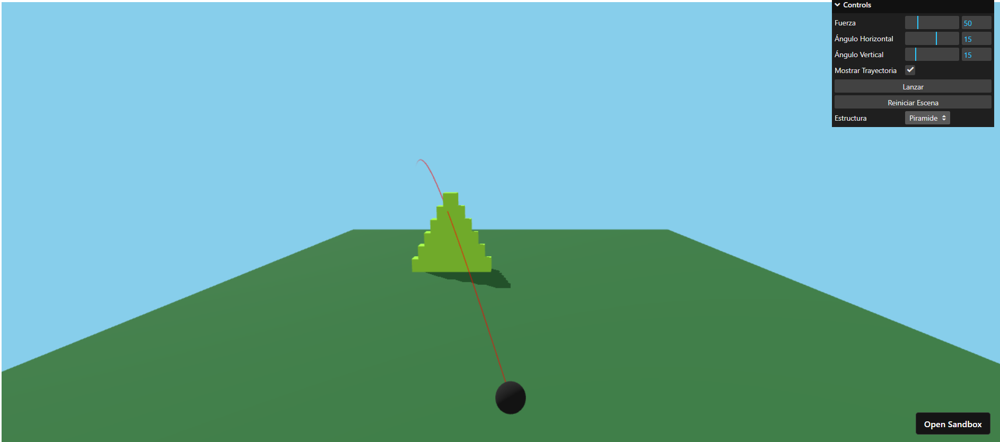

# IG-Animación
## Objetivo
La meta de este trabajo es desarrollar una aplicación para la visualización de impactos en diferentes estructuras mediante el uso de la librería de física ammo.js.
Los objetos que se demolerán con una esfera son: una torre, un muro, una pirámide y un cubo. El lanzamiento es personalizable a través de parámetros como el ángulo o la fuerza inicial.
Todos los parámetros se podrán configurar desde una GUI que incorpora la aplicación.

## Flujo de la aplicación
En primera instancia la aplicación espera a que se cargue la librería ammo.js. Una vez finalizado este proceso, se llama a la función init que se encargará de configurar el mundo físico, la escena de Three.js, el suelo, las estructuras, la esfera, la trayectoria, la interfaz gráfica y arrancar la animación.
Para realizar esta tarea utiliza funciones específicas de ammo.js como btDefaultCollisionConfiguration() (que define las colisiones), btCollisionDispatcher(collisionConfiguration) (el dispatcher que se encarga de decidir qué objetos están colisionando y calcular los puntos de contacto), btDbvtBroadphase() (que identifica rápidamente los pares de objetos cuyas cajas delimitadoras se superponen potencialmente) y btSequentialImpulseConstraintSolver() (que resuelve las fuerzas, impulsos y choques reales entre los cuerpos).
Con todos estos componentes se crea el mundo físico mediante el uso de la función btDiscreteDynamicsWorld(). Una vez realizado este proceso se inicializa la parte gráfica con la función initThree(). Esta función crea la escena (scene = new THREE.Scene()), el fondo, al que asigna un color y añade niebla. Posteriormente crea y configura la cámara para que se sitúe detrás de la esfera (camera = new THREE.PerspectiveCamera(60, aspectRatio, 0.1, 1000); camera.position.set(0, 8, -30);). También se crea el renderer con antialiasing (renderer = new THREE.WebGLRenderer({ antialias: true });) y se ajusta el tamaño a la ventana del navegador. Finalmente se activa el orbitcontrol y se crean las luces de la escena (ambiental y direccional).
Tras la creación de ambas partes se procede a añadir cada elemento de la escena y el panel de control con las funciones: createGround(), createStructureByIndex(), createSphere(), createTrajectoryLine(), initGUI().
Finalmente se llama a la función animate(). El bucle animate en cada iteración actualiza la física, la trayectoria, la posición y renderiza la escena (updatePhysics(dt), updateTrajectory(), controls.update() y renderer.render(scene, camera)).

### Funciones auxiliares

#### createGround()
La función createGround() crea un plano físico y visual que actúa como el suelo del mundo mediante el uso de ammo.js, de modo que los objetos puedan chocar sobre él.
Para conseguir esto primero se crea la forma del suelo (const groundGeo = new THREE.BoxGeometry(40, 1, 40)) y el material para que pueda interactuar con las luces (const groundMat = new THREE.MeshStandardMaterial({ color: 0x3a7d44 });). También se debe crear el mesh y activar la opción receiveShadow para que los objetos proyecten su sombra sobre él (const ground = new THREE.Mesh(groundGeo, groundMat); ground.receiveShadow = true; scene.add(ground);).
La parte anteriormente descrita se corresponde al plano visual. Para implementar las físicas se debe de definir la zona de colisiones (const shape = new AmmoLib.btBoxShape(new AmmoLib.btVector3(20, 0.5, 20));). El tamaño debe de ser la mitad que el del mesh.
Una vez definida la zona de colisiones hay que trasladarla a la posición del suelo (const transform = new AmmoLib.btTransform(); transform.setIdentity(); transform.setOrigin(new AmmoLib.btVector3(0, -0.5, 0));) y crear un rigidbody al que se le pasan estos parámetros y 0 (en masa) para indicar que es estático (const rbInfo = new AmmoLib.btRigidBodyConstructionInfo(0, // masa = 0 motionState, shape, new AmmoLib.btVector3(0, 0, 0));).
Finalmente se añade el cuerpo a la escena.

#### createBox()
La función createBox es el eje sobre el que se construyen las estructuras a demoler. La función necesita una serie de parámetros iniciales: la posición donde se colocará el cubo, el ancho, el alto, la profundidad, el color y la masa que por defecto está a 1, lo cual indica que es un cuerpo no estático (createBox(x, y, z, sx, sy, sz, color, mass = 1)).
En primera instancia se crea la forma y el material (const mesh = new THREE.Mesh(new THREE.BoxGeometry(sx, sy, sz), new THREE.MeshStandardMaterial({ color }));). Se posiciona el bloque sobre las coordenadas, se activan las sombras y se añade a la escena. En cuanto a la parte física se vuelve a crear la forma (const shape = new AmmoLib.btBoxShape(new AmmoLib.btVector3(sx * 0.5, sy * 0.5, sz * 0.5));), se sitúa la forma sobre el cubo y se calcula la inercia según la masa (const localInertia = new AmmoLib.btVector3(0, 0, 0); shape.calculateLocalInertia(mass, localInertia);).
Mediante (const motionState = new AmmoLib.btDefaultMotionState(transform);) se permite que ammo actualice la posición del mesh en cada frame. Finalmente se crea el rigidbody, se añade a la escena y se guarda en un array (rigidBodies.push({ mesh, body });) para que updatePhysics() los mantenga sincronizados.

##### createTower()
La función createTower() crea una torre vertical de cubos mediante el uso de createBox().

##### createWall()
La función createWall() crea una pared rectangular de 6*6 bloques usando la función createBox().

##### createPyramid()
La función createPyramid() crea una pirámide escalonada donde cada bloque es creado usando createBox().

##### createBigCube()
La función createBigCube() crea un cubo grande de un solo bloque con createBox().

#### createSphere()
La función createSphere() sigue el mismo flujo de creación que createBox() pero ajusta ciertos parámetros para que se trate de una esfera en vez de un cubo (const geo = new THREE.SphereGeometry(0.5, 32, 32);).
Tras la creación visual de la misma y su añadido a la escena se crea la forma física (const shape = new AmmoLib.btSphereShape(radius);), se traslada a la posición designada, se calcula la inercia, se crea el cuerpo rígido y se añade a la escena y al array de objetos.

#### createTrajectoryLine()
La función createTrajectoryLine() crea una línea roja de 50 puntos que inicialmente están todos en (0,0,0).
Luego, otra función (updateTrajectory()) reemplaza esos puntos con la trayectoria real antes del lanzamiento.
Para hacer esto crea los puntos (const points = Array.from({ length: 50 }, () => new THREE.Vector3(0, 0, 0));) vacíos y usa la función THREE.Line para crear la línea. Finalmente la añade a la escena.

#### updateTrajectoryLine()
updateTrajectoryLine actualiza punto por punto la trayectoria prevista del disparo, redibujando la línea en pantalla mientras la esfera no haya sido lanzada.
Se realizan dos comprobaciones en variables booleanas para ver si se dibuja la línea (trajectoryLine y sphereLaunched). Tras estas comprobaciones se obtiene la dirección del lanzamiento (const dir = getLaunchDirection().multiplyScalar(params.force);), se aplica la gravedad (const g = new THREE.Vector3(0, -9.8, 0);) y se define el paso temporal para cada punto (const dt = 0.05;). En un bucle se calcula cada punto con la ecuación del movimiento parabólico g*0.5*t^2 (const t = dt * i; const p = start.clone().add(dir.clone().multiplyScalar(t)).add(g.clone().multiplyScalar(0.5 * t * t));). Cada punto se guarda en un buffer y si (if (p.y < 0) break;) toca el suelo se interrumpe el proceso.

#### getLaunchDirection()
La función getLaunchDirection() calcula la dirección en la que se lanzará la esfera, basándose en los valores del ángulo vertical y horizontal y devuelve un vector normalizado.

#### launchSphere()
launchSphere() es la función encargada de disparar la esfera.
La función comienza situando la esfera en la posición inicial, resetea las velocidades para mantenerla estática por si acaso se quedan valores de iteraciones anteriores y se calcula la dirección del disparo (const dir = getLaunchDirection().multiplyScalar(params.force * 2);) y se le pasa al vector de ammo (const impulse = new AmmoLib.btVector3(dir.x, dir.y, dir.z);). Finalmente se realiza el impulso (sphereBody.applyCentralImpulse(impulse);) mediante el uso de la función applyCentralImpulse.

#### updatePhysics()
El código asociado a updatePhysics() es el encargado de sincronizar la física de Ammo.js con los objetos visuales de Three.js. Al principio avanza la simulación (physicsWorld.stepSimulation(dt, 10);) calculando posiciones, velocidades, colisiones y rebotes de todos los objetos. Posteriormente recorre todos los cuerpos y obtiene el estado actualizado de cada objeto tras stepSimulation para copiar la posición y rotación al mesh de Three.js.

## Resultado 

## Video demostrativo 

## Enlace al código

https://lrjdmg.csb.app/
https://codesandbox.io/p/sandbox/ig2526-s10-forked-lrjdmg

